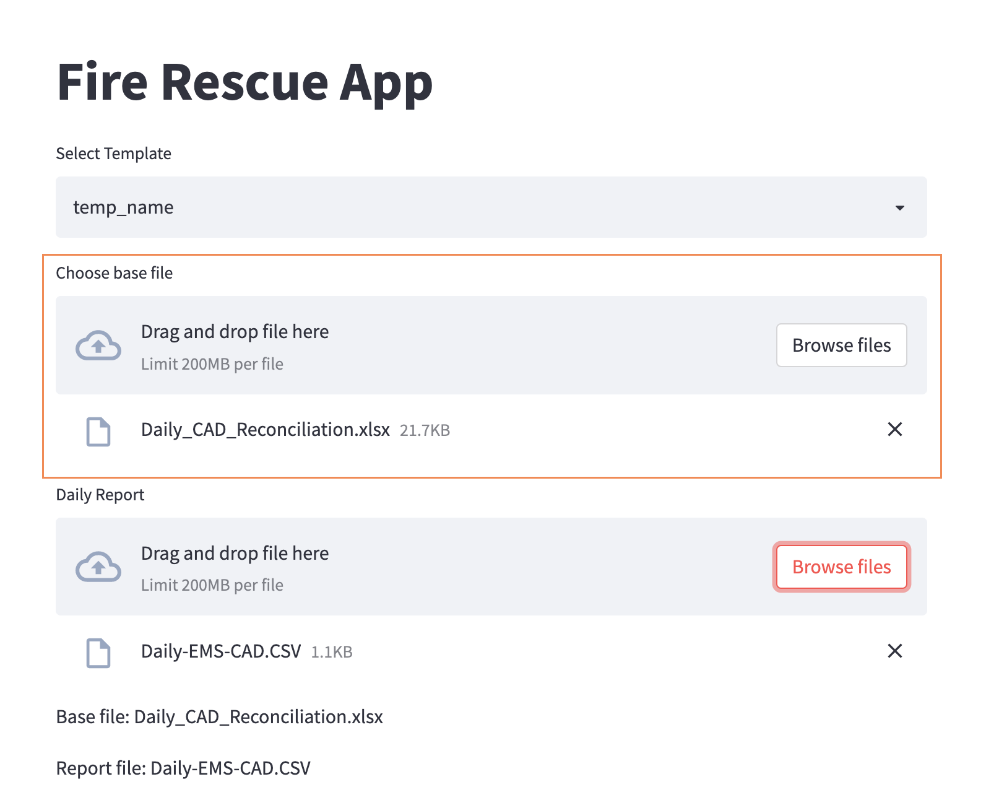

# Frederick Fire Rescue Data Analytics
The Frederick Fire Rescue data analytics platform analysis data from various source reports. This documentation serves as a guide for 
## Commands

* `streamlit run src/app.py` - Starts the application in development mode

## Project layout

All the project app files are stored in the `src` folder.

## Merging New Data Points
From the application portal,     
1. Select the base file    
2. Select the new report file    

